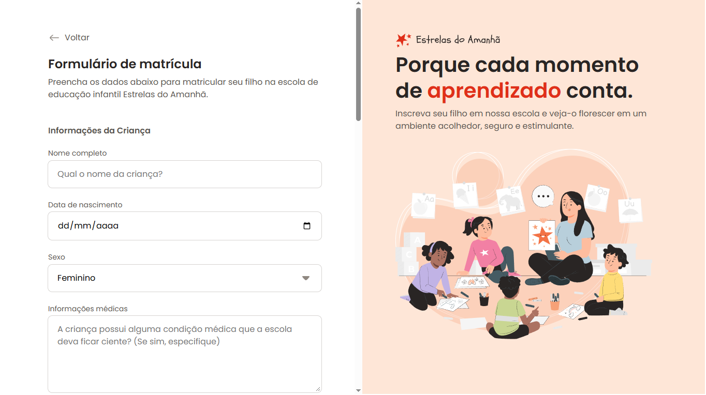

-----

# Formulário de Matrícula

Formulário de matrícula para a inscrição de crianças em atividades esportivas. Este projeto foi desenvolvido para fins de estudo e prática de HTML e CSS.

## 📸 Captura de Tela

## 🚀 Tecnologias

  - **HTML**: Utilizado para a estrutura e conteúdo do formulário.
  - **CSS**: Responsável pela estilização e design do formulário.

## 🎯 Funcionalidades

  - Preenchimento de dados pessoais do aluno.
  - Escolha da modalidade esportiva.
  - Seção para informações dos pais ou responsáveis.

## 📦 Acesso ao Projeto

Você pode acessar o código-fonte e o projeto através do link:

[https://github.com/luccas-dev/formulario\_matricula](https://github.com/luccas-dev/formulario_matricula)

## 💻 Como Usar

1.  Clone o repositório para a sua máquina local:
    `git clone https://github.com/luccas-dev/formulario_matricula.git`
2.  Navegue até a pasta do projeto:
    `cd formulario_matricula`
3.  Abra o arquivo `index.html` em seu navegador para visualizar o formulário.

-----